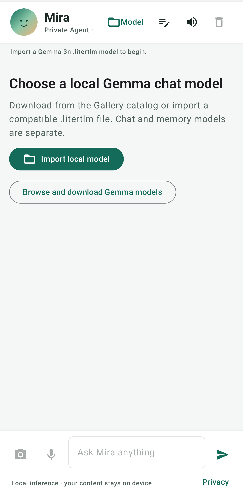
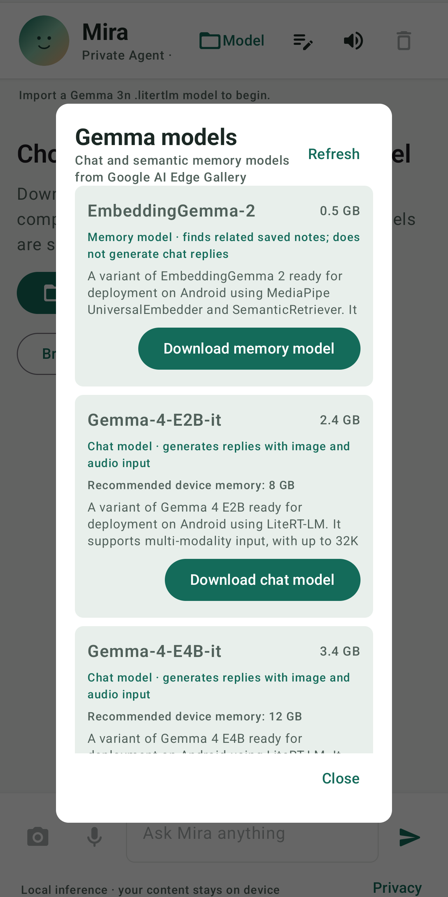

# Mira - Private Agent

Native Android chat with on-device Gemma models. Text, camera snapshots, and microphone clips are sent to LiteRT-LM locally. Conversation turns and notes are stored on-device; reminders are scheduled with Android WorkManager notifications. The assistant can speak responses aloud with Android TextToSpeech.

## Requirements

- Android Studio with Android SDK Platform 36 and JDK 17 or later
- Android 12 (API 31) or later; a physical device with enough free memory for the chosen model is strongly recommended
- Internet access for loading Google AI Edge Gallery's model catalog and downloading a model
- About 4 GB free storage for Gemma 3n E2B; check each catalog entry's device-memory recommendation before downloading

This app runs model inference offline after importing the model. It does not include live web search, so answers about current events or changing facts may be out of date.

## Run

1. Open this directory in Android Studio and allow Gradle to sync.
2. Connect an Android 12+ device and run the `app` configuration.
3. Tap **Model** in the header or **Browse and download Gemma models**. Choose a multimodal Gemma chat model from the Google AI Edge Gallery catalog and download it. Previously downloaded models can be selected again without downloading twice. You can also import a compatible `.litertlm` chat model manually.
4. Ask by text, use the camera button to attach a snapshot, or grant microphone permission and dictate a message. Android's on-device speech recognizer transcribes speech first; only the recognized text is sent to Gemma. On-device speech recognition must be available and have an offline language pack installed. Use the speaker controls to hear answers.
5. Tap the notebook icon to save notes, create reminders, or review and delete them. Grant notification permission when prompted for reminders.

The catalog also offers **EmbeddingGemma 2** as a separate memory model. Download and enable it to index saved notes locally and retrieve relevant notes by meaning in later chats. For a camera question, EmbeddingGemma converts the image into a vector to find related notes; that vector is not a caption or transcription. The original image is passed to the selected image-capable Gemma chat model to describe and answer the question. EmbeddingGemma itself cannot replace the chat model.

The first model load can take several seconds. Model files are large; ensure the device has sufficient storage and memory. Image/audio inference requires a model that supports those modalities, such as Gemma 3n.

## Google Play release

The app targets Android 16 (API 36), uses an Android App Bundle, and keeps the current application ID `com.amit.gemmcompanion`. Confirm that ID is available and final before the first Play Console upload; a published app cannot change its application ID.

Create a private upload keystore on your Mac and keep a secure backup. For example:

```sh
mkdir -p "$HOME/.android"
keytool -genkeypair -v -keystore "$HOME/.android/mira-play-upload.jks" -alias mira-upload -keyalg RSA -keysize 4096 -validity 10000
```

Copy `keystore.properties.example` to `keystore.properties`, then set `storeFile` to the absolute path of your keystore and replace the alias and password placeholders. Keep both private files backed up securely; they are excluded from Git. Build the signed bundle with `./gradlew bundleRelease`; the AAB is written to `app/build/outputs/bundle/release/app-release.aab`. Enroll in Play App Signing on the first upload so Google manages the app-signing key while you retain the upload key.

Before production, verify the AAB's native libraries are 16 KB page-size compatible. LiteRT-LM and MediaPipe include native code; check the AAB/APK in Android Studio APK Analyzer and test on a 16 KB emulator or device. Increase `APP_VERSION_CODE` for each subsequent upload.

## Memory and privacy

Conversation turns, notes, and EmbeddingGemma2 vectors are stored locally on the device. In chat, prefix a message with “remember that”, “take a note”, or “save this” to capture a note automatically; assistant replies can also be saved with the note icon. With EmbeddingGemma2 enabled, relevant saved notes are retrieved locally for each new question. Voice is transcribed with Android's on-device speech recognizer; raw audio is not attached to the Gemma chat request. The Gallery catalog is fetched from Google AI Edge Gallery; selected model files are downloaded from their listed Hugging Face repositories to app-private storage. Use the trash icon to clear chat memory; use the notebook to delete notes/reminders. Android's system TextToSpeech may use its installed voice provider; text-to-speech is separate from Gemma inference.

## Implementation references

- [Google AI Edge Gallery](https://github.com/google-ai-edge/gallery)
- [LiteRT-LM Kotlin API](https://github.com/google-ai-edge/LiteRT-LM/blob/main/docs/api/kotlin/getting_started.md)

## Screenshots

<p align="center">
	
	
</p>